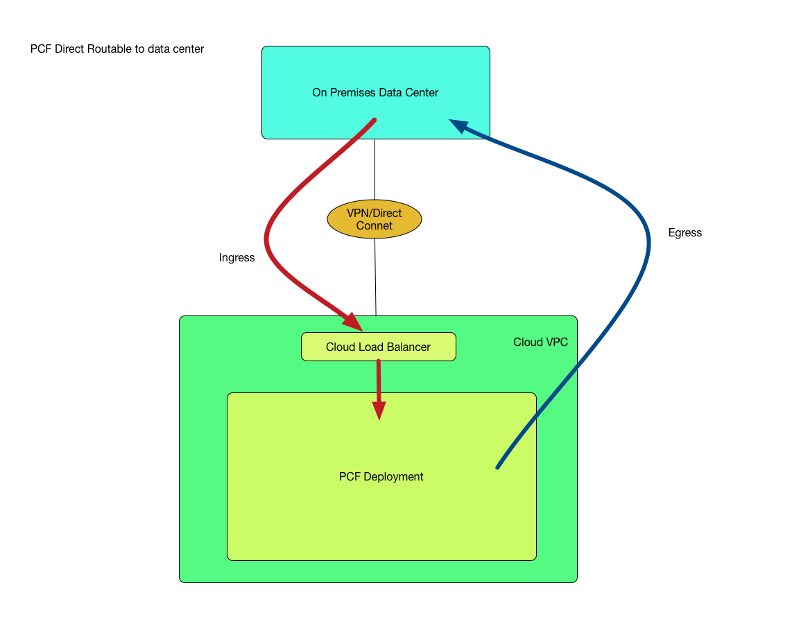
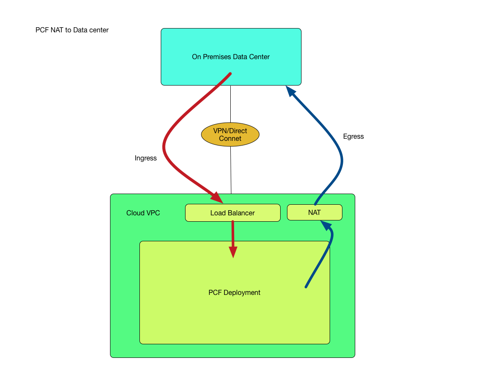

#Pivotal Customer0 _Public Cloud - PCF Connecting to On Premises_ Guidance

*__Goal__*:  This Guidance helps PCF users understand the needs of connecting to on premises, as well as thoughtful _network_ design and PCF implementation on AWS, Azure, and GCP options.

*__Non-Goals__*:

- This PCF Connecting to On Premises is published as is with no warranty or support expressed or implied!

##Decide whether to connect PCF to On Premises

The following requirements usually drives the decision to hook PCF on public cloud to on premise:

* On Premises DNS/NTP Servers
* Centralized security control E.g. outbound internet traffic
* PCF System domain and Ops Manager access can not be exposed on the internet
* Apps on PCF need legacy data tier access E.g. oracle database residing on premise

## Network Design

### PCF Facts
* PCF ingress traffic comes in through load balancer
* PCF egress traffic goes out through subnet gateway
* PCF Elastic Runtime needs big IP blocks E.g. /22 or /23
* Public Cloud provides VPN solutions/Dedicated network connections to connect virtual private cloud and on premise
* The VPC IP CIDR should be a reserved range from On Premises network

There are two ways that PCF egress traffic route to On Premises. Direct Route vs Route Through NAT devices

### Direct Routable

_Pros_:

* Easy to setup and manage
* No additional hop through NAT device that gains performance benefits

_Cons_:

* It may not be realistic to ask for multiple routable /22 or /23 address spaces due to IP exhaustion
* Using different VPC address spaces can cause snowflakes deployments and present difficulties in automation

### Route Through NAT devices

_Pros_:

* Same IP address spaces across multiple PCF foundations.
* Simplifying automation, upgrade and migration.
* Simplifying security due no direct routes from app on Cloud to on premises

_Cons_:

* Need additional route table setup
* Need to provision nat devices which can potentially be a SPOF
* It requires Layer 4 Load Balancer to support SNAT (So returning packet of ingress can go back through Load Balancer)

_Recommendation_: NAT implementation may need extra considerations at the initial setup, but it simplifies the PCF management in long run by using same IP blocks across multiple foundations. It also alleviate the concerns of IPV4 exhaustion which is very common in large enterprise

## VPN Solution Comparison and References

| Public Cloud        | AWS           | Azure  |GCP|
| ------------- |:-------------:| -----:|-----:|
| VPN      | [AWS VPN](http://docs.aws.amazon.com/AmazonVPC/latest/UserGuide/vpn-connections.html) |[Azure VPN](https://docs.microsoft.com/en-us/azure/vpn-gateway/vpn-gateway-site-to-site-create) | [GCP VPN](https://cloud.google.com/compute/docs/vpn/overview) |
| Enterprise Grade Connection  | [Direct Connect](https://aws.amazon.com/directconnect/)| [Express Route](https://azure.microsoft.com/en-us/services/expressroute/)| [Cloud Interconnect](https://cloud.google.com/interconnect/)|
