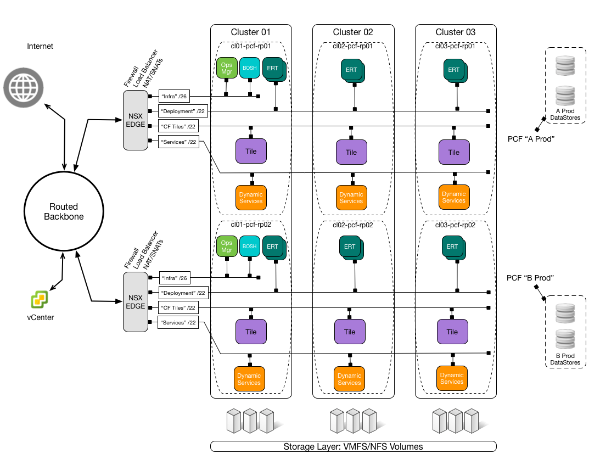
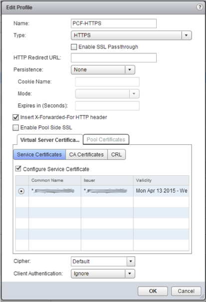
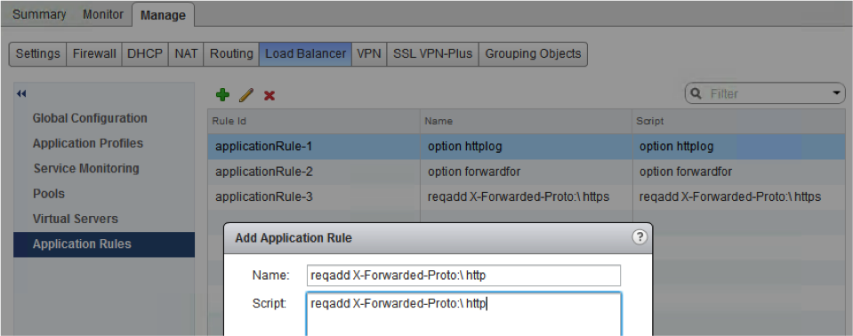
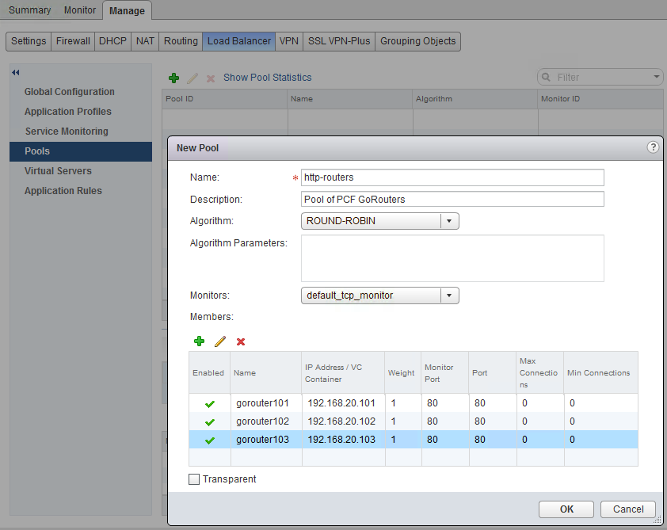
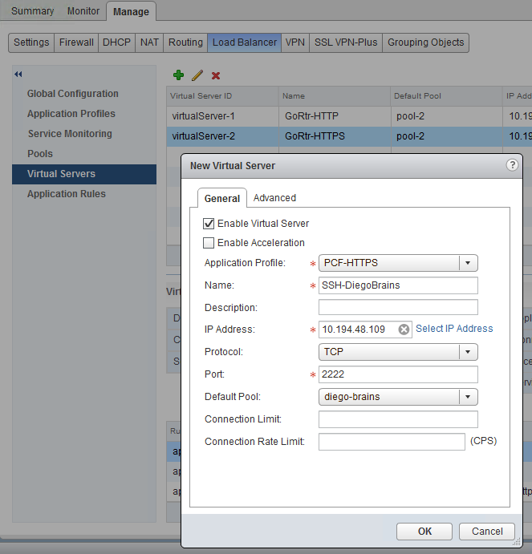

# Pivotal Customer[0] Cookbook

## NSX Edge for PCF

SUMMARY OF STEPS TO CONFIGURE NSX EDGE FIREWALL, LOAD BALANCING & NAT/SNAT FOR PIVOTAL CLOUD FOUNDRY INSTALLATION

## Assumptions

This cookbook is intended to provide simple guidance on using an NSX Edge to provide firewall, load balancing & NAT/SNAT services to a PCF deployment. These services take the place of an external device or the bundled HAProxy VM in PCF. This document assumes that the reader has a level of skill required for basic install and configuration of the following products:

-	VMware vSphere 5.5 or greater
-	NSX 6.1.x or greater
-	PCF 1.3 or greater

For detailed install & configure information on the above products, please refer to the following:

-	[vSphere Docs](https://www.vmware.com/support/pubs/vsphere-esxi-vcenter-server-pubs.html)
-	[NSX Install Guide](https://pubs.vmware.com/NSX-6/topic/com.vmware.ICbase/PDF/nsx_6_install.pdf)
-	[NSX Design Guide](https://www.vmware.com/files/pdf/products/nsx/vmw-nsx-network-virtualization-design-guide.pdf)
-	[Pivotal Cloud Foundry Docs](http://docs.pivotal.io/pivotalcf/getstarted/pcf-docs.html)

## General Overview

This cookbook will follow a three-step recipe to deploy a PCF foundation behind an NSX Edge: Configure Firewall, Configure Load Balancer, Configure NAT/SNAT. The NSX Edge can scale up to very large PCF deployments as needed.

This cookbook will focus on a single site foundation & will make the following design assumptions:

-	There will be four non-routable networks on the tenant (inside) side of the NSX Edge
	 - The “Infra” network will be used to deploy Ops Manager and BOSH Director
   -	The “Deployment” network will be use exclusively by Elastic Runtime for deploying DAEs/Cells for hosting apps & related elements
   -	The “CF Tiles” network will be used for all other deployed Tiles in a PCF installation
	 - The "Dynamic Services" network will be used by BOSH Director for service tiles
-	There will be a single service provider (outside) interface on the NSX Edge that will provide Firewall, Load Balancing & NAT/SNAT services.
-	Routable IPs should be applied to the service provider (outside) interface of the NSX Edge. It is recommended that 10 consecutive routable IPs be applied to each NSX Edge.
  -	One reserved for NSX use (Controller to Edge I/F)
  -	One for NSX Load Balancer to GoRouters
	- One for NSX Load Balancer to Diego Brains for SSH to apps
  -	One routable IP for use to front-end Ops Manager
  -	One routable IP for use with SNAT egress
  -	Five for future use

It is recommended that the NSX Edges be deployed as HA pairs in vSphere. Also, it is recommended that they be sized “large” or greater for any pre-prod or prod use. The deployed size of the NSX Edge impacts it's overall performance, including how many SSL tunnels it can terminate.

The NSX Edges will have an interface in each port group used by PCF as well as a port group on the service provider (outside), often called the “transit network”. Each PCF installation will have a set of port groups in a vSphere DVS to support connectivity, so that the NSX Edge arrangement is repeated for every PCF install. It is not necessary to build a DVS for each NSX Edge/PCF install. You do not re-use an NSX Edge amongst PCF deployments. NSX Logical Switches (VXLAN vWires) are ideal candidates for use with this architecture.

Example:

  

  The following is an example of a network architecture deployment.

  

## High Level Steps

The following steps are required for Networking Overview Image:

Pre-Req: DNS: Create Wildcard DNS Entries for System & Apps domains in PCF to map to the selected IP on the uplink (outside) interface of the NSX Edge in your DNS server. The wildcard DNS A record must resolve to an IP associated with the outside interface of the NSX Edge for it to function as a load balancer. You can either use a single IP to resolve both the system and apps domain, or one IP for each.

  1.	Assign IP Addresses to the “Uplink” (outside) interface
    *	Typically you will have one SNAT and three DNATs per NSX Edge
    *	IP associated for SNAT use: All PCF internal IPs will appear to be coming from this IP address at the NSX Edge.
    *	IP associated with Ops Manager DNAT: This IP will be the publicly routable interface for Ops Manager UI and SSH access
  2.	Assign ‘Internal’ Interface IP Address Space to the Edge Gateway.
    *	192.168.10.0/26 = PCF Deployment Network (Logical Switch or Port Group)
    *	192.168.20.0/22 = Deployment Network for Elastic Runtime Tile (ERT)
    *	192.168.24.0/22 = CF Tiles Network for all Tiles besides ERT
		* 192.168.28.0/22 = Dynamic Services network for BOSH Director-managed service tiles
  3.	Enable load balancer function
  4.	Enable firewall

### Firewall Configuration

This step will populate the NSX Edge internal firewall with rules to protect a PCF installation. They provide granular control on what can be accessed within a PCF installation. For example, this can be used to allow or deny another PCF installation behind a different NSX Edge access to apps published within the installation you are protecting.

This step is not required for the installation to function properly when the firewall feature is disabled or set to “Allow All”.

  _Navigate to Edge -> Manage –> Firewall & set the following …_

  |  Name |  Source |  Destination | Service  |  Action |
  |---|---|---|---|---|
  |Allow Ingress -> Ops Manager|any|IP_of_OpsMgr|SSH, HTTP, HTTPS|Accept|
  |Allow Ingress -> Elastic Runtime|any|IP_of_NSX-LB|HTTP, HTTPS|Accept|
  |Allow Ingress -> SSH for Apps|any|IP_of_DiegoBrain:2222|any|Accept|
  |Allow Inside <-> Inside|192.168.10.0/26 192.168.20.0/22 192.168.24.0/22 192.168.28.0/22|192.168.10.0/26 192.168.20.0/22 192.168.24.0/22 192.168.28.0/22|any|Accept|
  |Allow Egress -> IaaS|192.168.10.0/26|IP_of_vCenter IPs_of_ESXi-Svrs|   |Accept|
  |Allow Egress -> DNS|192.168.0.0/16|IPs_of_DNS|DNS, DNS-UDP|Accept|
  |Allow Egress -> NTP|192.168.0.0/16|IPs_of_NTP|NTP|Accept|
  |Allow Egress -> SYSLOG|192.168.0.0/16|IPs_of_Syslog:514|SYSLOG|Accept|
  |Allow ICMP|192.168.10.0/26|\*|ICMP|Accept|
  |Allow Egress -> LDAP|192.168.10.0/26 192.168.20.0/22|IPs_of_LDAP:389|LDAP, LDAP-over-ssl|Accept|
  |Allow Egress -> All Outbound|192.168.0.0/16 IP_of_NSX-LB|any|any|Accept|
  |Default Rule|any|any|any|Deny|

## Load Balancing Configuration

The NSX Edge performs a software load balancing function, such as the bundled HAProxy that’s included with PCF, or hardware appliances such as an F5 or A10 load balancer.

This step is required for the installation to function properly.

There are four stages to this procedure:

  1.	Create Application Profiles in the Load Balancing tab of NSX
  2.	Create Application Rules in the Load Balancer
  3.	Create Application Pools of the GoRouter IPs
  4.	Create a virtual server (also known as a VIP) to pool balanced IPs

What you will need:

  * PEM files of SSL certificates provided by the certificate supplier for only this installation of PCF, or the self-signed SSL certificates generated during PCF installation.

In this procedure you will marry the NSX Edge’s IP address used for load balancing with a series of internal IPs provisioned for GoRouters in PCF. It’s important to know the IPs used for the GoRouters beforehand. These can be pre-selected/reserved prior to deployment (recommended) or discovered after deployment by looking them up in BOSH Director, which will list them in the release information of the Elastic Runtime installation.

#### Import SSL Certificate.  PCF requires SSL termination at the load balancer.

_Navigate to Edge -> Manage –> Settings -> Certificates & set the following…_
  -	Green Plus button to Add Certificate
  -	Insert PEM file contents from Elastic Runtime/Networking
  -	Save the results

#### Enable The Load Balancer
_Navigate to Edge -> Manage –> Load Balancer -> Global Configuration & set the following …_

  -	Edit load balancer global configuration
  -	Enable Load Balancer
  -	Enable Acceleration
  -	Set Logging to desired level (“Info” or greater)

#### Create Application Profiles.  The Application Profiles will allow advanced X-Forward options as well as linking to the SSL Certificate.  You will create two Profiles: “PCF-HTTP” & “PCF-HTTPS”.

_Navigate to Edge -> Manage –> Load Balancer -> Global Application Profiles & set the following …_

  -	Create/Edit Profile and make “PCF-HTTP” rule, turning on “Insert X-Forwarded-For HTTP header
  -	Create/Edit Profile and make “PCF-HTTPS” rule, same as before, but add the service certificate inserted before.

  

  

#### Create Application Rules.

In order for the NSX Edge to perform proper X-Forwarded requests, a few HA Proxy directives need to be added to NSX Edge Application Rules.  NSX will support most directives that “HA Proxy” will support.

_Navigate to Edge -> Manage –> Load Balancer -> Application Rules & create the following …_

  -	Copy/paste the table entries below into each field

|Rule Name|Script|
|---|---|
|option httplog|option httplog|
|reqadd X-Forwarded-Proto:\ https|reqadd X-Forwarded-Proto:\ https|
|reqadd X-Forwarded-Proto:\ http|reqadd X-Forwarded-Proto:\ http|

#### Create “http-routers” Pool.

This is the pool of resources that NSX Edge is balancing TO, which are the GoRouters deployed by BOSH Director.  If the IP addresses here don’t match exactly the IP addresses reserved or used for the GoRouters, the pool will not effectively balance.

_Navigate to Edge -> Manage –> Load Balancer -> Pools_

  -	If following the Pivotal vSphere Reference Architecture, these IPs will be in the 192.168.20.0/22 address space.
  -	Enter ALL the IP addresses reserved for GoRouters into this pool. If you reserved more addresses than you have GoRouters, enter the addresses anyway and the load balancer will just ignore the missing resources as “down”.
  -	Note that the port & monitoring are on HTTP port 80; the assumption is that internal traffic from the NSX Edge load balancer to the gorouters is trusted, as it’s on a VXLAN secured within NSX. If using encrypted traffic inside the load balancer, adjust ports accordingly.
    -	Set the Algorithim to “ROUND-ROBIN”
    -	Set Monitors to “default_tcp_monitor”

	

#### Create Virtual Servers.

This is the VIP, or virtual IP that the load balancer will use to represent the pool of gorouters to the outside world. This also links the Application Policy, Application Rules, and backend pools to provide PCF load balancing services.  This is the interface that the load balancer balances FROM. You will create 3 Virtual Servers.

_Navigate to Edge -> Manage –> Load Balancer -> Virtual Servers_

	-	Select an IP address from the available routable address space allocated to the NSX Edge (see section General Overview above about reserved IPs)
	-	Create a new Virtual Server named “GoRtr-HTTP” and select Application Profile “PCF-HTTP”
		-	Use “Select IP Address” to select the IP to use as a VIP on the uplink interface
		-	Set Protocol to match the Application Profile protocol (HTTP) and set Port to match the protocol (80)
		-	Set Default Pool to the pool name set in the previous step (http-routers). This connects this VIP to that pool of resources being balanced to.
		-	Ignore Connection Limit and Connection Rate Limit unless these limits are desired.
		-	Switch to Advanced Tab on this Virtual Server
		-	Use the green plus to add/attach three Application Rules to this Virtual Server: (Be careful to match protocol rules to the protocol VIP- HTTP to HTTP and HTTPS to HTTPS!)
			-	option httplog
			-	reqadd X-Forwarded-Proto:\ http

		-	Create a new Virtual Server named “GoRtr-HTTPS” and select Application Profile “PCF-HTTPS”
			-	Use “Select IP Address” to select the **same IP** to use as a VIP on the uplink interface
			-	Set Protocol to match the Application Profile protocol (HTTPS) and set Port to match the protocol (443)
			-	Set Default Pool to the pool name set in the previous step (http-routers). This connects this VIP to that pool of resources being balanced to.
			-	Ignore Connection Limit and Connection Rate Limit unless these limits are desired.
			-	Switch to Advanced Tab on this Virtual Server
			-	Use the green plus to add/attach three Application Rules to this Virtual Server: (Be careful to match protocol rules to the protocol VIP- HTTP to HTTP and HTTPS to HTTPS!)
				-	option httplog
				-	option forwardfor
				-	reqadd X-Forwarded-Proto:\ https

		-	Create a new Virtual Server named “SSH-DiegoBrains” and select Application Profile “PCF-HTTPS”
			-	Use “Select IP Address” to select the same IP to use as a VIP on the uplink interface if you want to use this address for SSH access to apps. If not, select a different IP to use as the VIP.
			-	Set Protocol to TCP and set Port to 2222.
			-	Set Default Pool to the pool name set in the previous step (diego-brains). This connects this VIP to that pool of resources being balanced to.
			-	Ignore Connection Limit and Connection Rate Limit unless these limits are desired.

## NAT/SNAT configuration

The NSX Edge obfuscates the PCF installation thru network translation. The PCF installation is placed entirely on non-routable RFC-1918 network address space, so to be useful, you must translate routable IPs to non-routable IPs to make connections.

_This step is required for the installation to function properly._

|Action|Applied on Interface|Original IP|Original Port|Translated IP|Translated Port|Protocol|Description|
|---|---|---|---|---|---|---|---|
|SNAT|uplink|192.168.0.0/16|any|IP_of_PCF|any|any|All Nets Egress|
|DNAT|uplink|IP_of_OpsMgr|22|192.168.10.OpsMgr|22|tcp|SSH OpsMgr|
|DNAT|uplink|IP_of_OpsMgr|80|192.168.10.OpsMgr|80|tcp|HTTP OpsMgr|
|DNAT|uplink|IP_of_OpsMgr|443|192.168.10.OpsMgr|443|tcp|HTTPS OpsMgr|

_This function is not required if routable IP address space is used on the Tenant Side of the NSX Edge. At that point, the NSX Edge simply performs routing between the address segments._

# Conclusion

It should be noted that the NSX Edge Gateway does also support scenarios where Private RFC subnets & NAT are not utilized for ‘Deployment’ or ‘Infrastructure’ networks, and the guidance in this document can be modified to meet those scenarios.  Additionally, the NSX Edge supports up to 10 Interfaces allowing for more Uplink options if necessary.

This document is intended to present the reader with the fundamental configuration options of an NSX Edge with PCF.   Its purpose is not to dictate the settings required on every deployment, but instead to empower the NSX Administrator with the ability to have a known good ‘base’ and apply specific security configurations as required.

With respect to the Private RFC-1918 subnets for PCF Deployment networks.  This architecture was chosen due to it popularity with customers, NSX Edge devices are capable of leveraging OSPF, BGP, & IS-IS to handle dynamic routing of customer and/or public L3 IP space.  That design is out of scope for this document, but is supported by VMware NSX & Pivotal PCF.
